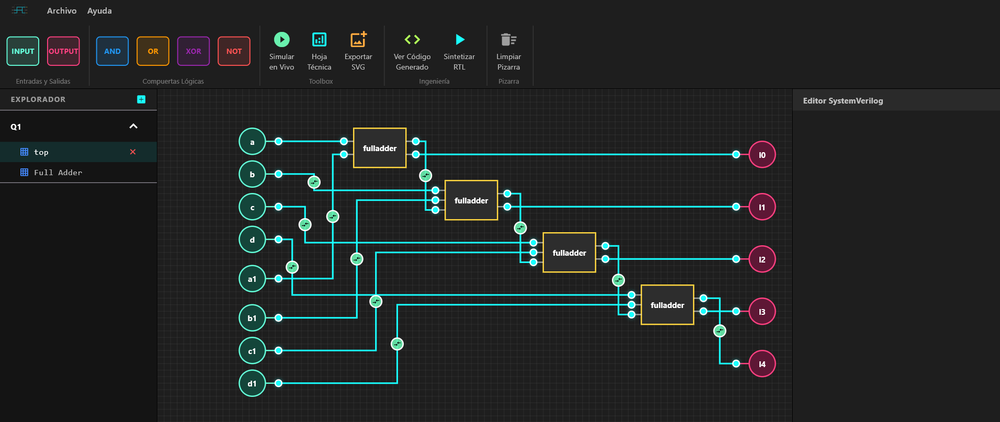

---
hide:
  - toc
---

<!-- =========================================================
     HERO
     ========================================================= -->

  

    ARCLAB STUDIO
  

  <h1 style="font-size: 3.4em; font-weight: bold; margin: 0 0 12px 0;">
    Diseña. Visualiza. Genera.
  </h1>

  

    Una herramienta para diseñar circuitos digitales, máquinas de estado
    y lógica RTL desde una única interfaz.
  

  

    V 1.3.3 &nbsp;•&nbsp; Alpha Release
  

  

    <a href="descargas/"
       class="md-button md-button--primary"
       style="margin-right: 12px; font-weight: bold;">
      Descargar ArcLab
    </a>

    <a href="tutoriales/entorno/"
       class="md-button">
      Explorar ArcLab
    </a>

  

<!-- =========================================================
     PREVISUALIZACIÓN DEL SOFTWARE
     ========================================================= -->

  

<!-- =========================================================
     INTRODUCCIÓN
     ========================================================= -->

  <h2>Todo lo que necesitas para diseñar sistemas digitales</h2>

  

    ArcLab reúne las principales herramientas utilizadas durante
    el diseño de sistemas digitales en un único entorno visual,
    reduciendo la necesidad de alternar entre diferentes programas.
  

<!-- =========================================================
     CARACTERÍSTICAS PRINCIPALES
     ========================================================= -->

<h2 style="text-align: center; margin-bottom: 35px;">
  Características principales
</h2>

  <!-- ESQUEMÁTICOS -->

  

    <h3 style="margin-top: 0; color: #00e5ff;">
      ◇ Esquemáticos
    </h3>

    

      Diseña circuitos utilizando compuertas lógicas, módulos
      y registros mediante una interfaz visual e intuitiva.
    

  

  <!-- FSM -->

  

    <h3 style="margin-top: 0; color: #00e5ff;">
      ◇ Máquinas de Estado
    </h3>

    

      Construye máquinas de Moore y Mealy y visualiza sus
      estados y transiciones en tiempo real.
    

  

  <!-- SYSTEMVERILOG -->

  

    <h3 style="margin-top: 0; color: #00e5ff;">
      ◇ RTL / SystemVerilog
    </h3>

    

      Genera código SystemVerilog estructurado desde tus diseños
      o convierte RTL en diagramas lógicos.
    

  

<!-- =========================================================
     FLUJO DE TRABAJO
     ========================================================= -->

  <h2 style="text-align: center; margin-bottom: 15px;">
    Del diseño al código
  </h2>

  

    Un flujo de trabajo pensado para sistemas digitales.
  

  

    

      <strong style="color: #00e5ff;">01</strong> 
      Diseña
    

    

      →
    

    

      <strong style="color: #00e5ff;">02</strong> 
      Visualiza
    

    

      →
    

    

      <strong style="color: #00e5ff;">03</strong> 
      Genera RTL
    

    

      →
    

    

      <strong style="color: #00e5ff;">04</strong> 
      Implementa
    

  

<!-- =========================================================
     HERRAMIENTAS INTEGRADAS
     ========================================================= -->

<h2 style="text-align: center; margin-bottom: 35px;">
  Herramientas integradas
</h2>

  

    <h3 style="margin-top: 0;">
      Álgebra Booleana
    </h3>

    

      Simplificación paso a paso mediante axiomas
      del álgebra de Boole y exportación a LaTeX.
    

  

  

    <h3 style="margin-top: 0;">
      Diagramas de Tiempo
    </h3>

    

      Analiza ticks y señales para estudiar y depurar
      circuitos secuenciales.
    

  

  

    <h3 style="margin-top: 0;">
      Exportación
    </h3>

    

      Genera imágenes de tus diseños listas para
      incorporar en informes y documentación.
    

  

<!-- =========================================================
     ENFOCADO EN APRENDIZAJE
     ========================================================= -->

  <h2 style="margin-top: 0;">
    Diseñado para aprender sistemas digitales
  </h2>

  

    Desde los primeros circuitos combinacionales hasta máquinas
    de estado y diseños RTL, ArcLab busca reunir en un solo
    entorno las herramientas necesarias para estudiar y desarrollar
    sistemas digitales.
  

<!-- =========================================================
     CALL TO ACTION FINAL
     ========================================================= -->

  

    ARCLAB STUDIO
  

  <h2 style="
    font-size: 2em;
    margin-bottom: 12px;
  ">
    ¿Listo para diseñar?
  </h2>

  

    Descarga ArcLab y comienza tu próximo proyecto digital.
  

  <a href="descargas/"
     class="md-button md-button--primary"
     style="font-weight: bold;">
    Descargar ArcLab
  </a>

  

    V 1.3.3 • Alpha Release
  

